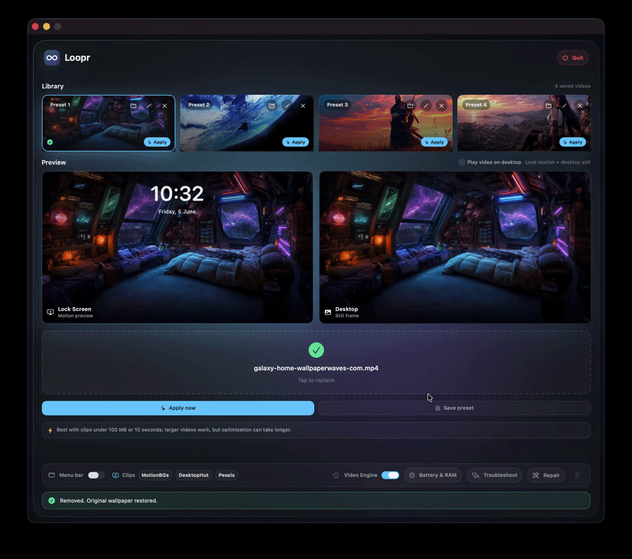

# Loopr

Loopr turns your own videos into macOS-style Aerial wallpapers: motion on the Lock Screen, a still frame on the desktop, and optional live video on the desktop when you want it.

[Download Looper](https://github.com/Dwight0007/looper-v1/raw/main/dist/Loopr-Beta.dmg)

## Native-style motion on the Lock Screen

## Apply, preview, and manage presets

## Why Loopr

Loopr was built with one goal: make your own videos behave as close as possible to Apple's native Aerial wallpapers.

The default mode prepares your clip and registers it with macOS's wallpaper/aerial pipeline, so the Lock Screen gets motion while the desktop settles into a still frame. For users who want more motion, Loopr also includes a Video Engine mode that can keep a lightweight desktop video surface running.

The result is a flexible live-wallpaper workflow:

- Native-style Lock Screen motion through macOS WallpaperAgent
- Still desktop frame, like Apple's own Aerial wallpapers
- Optional Video Engine modes for smoother transitions or live desktop motion
- Four saved video presets with quick Apply buttons
- Local optimisation and cache reuse when the same video is applied again
- Repair and troubleshooting tools for macOS wallpaper resets
- Fully offline: no analytics, no account, no cloud upload

During normal idle use, Loopr is designed to stay small. CPU, memory, and disk usage can temporarily rise while a video is being optimised or applied because the app transcodes the clip and writes local wallpaper data.

## Three Wallpaper Modes

| Mode | Best For | Desktop Behavior | Expected Idle Use |
| --- | --- | --- | --- |
| **Video Engine disabled** | Closest to Apple's Aerial behavior | Still desktop frame after unlock | Lowest: near native macOS aerial usage |
| **Video Engine: Still Desktop** | Smoother unlock feel without constant desktop motion | Brief motion, then pauses on a still frame | Low: roughly 80-150 MB RAM, negligible battery after settle |
| **Video Engine: Live Desktop** | Full motion on both Lock Screen and desktop | Video keeps playing on desktop | Higher: roughly 120-250 MB RAM, about 1-3% battery per hour depending on video/display |

These are practical beta estimates, not lab measurements. Actual usage depends on resolution, codec, display count, brightness, and whether the video is actively playing.

## Features

- Apply your own MP4, MOV, or M4V as a macOS-style wallpaper
- Lock Screen motion with desktop still frame
- Optional live desktop video through Video Engine
- Side-by-side preview for Lock Screen and desktop behavior
- Four saved video presets with quick Apply buttons
- One-click Apply flow
- HEVC optimisation for macOS's aerial wallpaper path
- Optimisation cache reuse for instant reapply of unchanged videos
- Optional menu bar item, hidden by default
- In-app Battery & RAM comparison
- In-app video source shortcuts for MotionBGs, DesktopHut, and Pexels
- Troubleshoot and Repair tools
- Clean remove/restore flow
- Offline local processing

## Download And Install

1. Download [Loopr-Beta.dmg](https://github.com/Dwight0007/looper-v1/raw/main/dist/Loopr-Beta.dmg).
2. Open the DMG.
3. Drag **Loopr.app** into **Applications**.
4. Launch Loopr from Applications.

Loopr beta builds are currently ad-hoc signed and not notarized by Apple. This does not expose any Apple Developer credentials or Team ID, but macOS Gatekeeper may block the first launch.

## Passing Gatekeeper

If macOS says Loopr cannot be opened because Apple cannot check it:

1. Open **Applications** in Finder.
2. Right-click **Loopr.app**.
3. Choose **Open**.
4. Click **Open** again in the confirmation dialog.

If macOS still blocks it:

1. Open **System Settings**.
2. Go to **Privacy & Security**.
3. Scroll to the security message about Loopr.
4. Click **Open Anyway**.
5. Confirm the final prompt.

This is expected for the current beta because it is not notarized yet.

## Usage

1. Open Loopr.
2. Drop a video into the app, or choose one of your presets.
3. Pick your preferred mode.
4. Click **Apply now**.
5. Lock your Mac to see the video on the Lock Screen.
6. Unlock to return to the selected desktop behavior.

After applying, Loopr can keep itself available in the background so it can help macOS recover the wallpaper transition after lock/unlock or restart. The menu bar icon is optional and can be enabled inside the app.

## Recommended Video Size

Loopr does not enforce a strict video length or file-size limit, but shorter clips work best.

For faster optimisation and smoother setup, use clips under **100 MB** or around **10 seconds**.

Larger or movie-length videos may still work, but optimisation can take much longer, use more temporary disk space, and behave less predictably with macOS's native wallpaper internals.

## Where To Find Videos

You can use your own clips or find free/royalty-friendly motion wallpapers from sites like:

1. [MotionBGs](https://motionbgs.com/)
2. [DesktopHut](https://www.desktophut.com/)
3. [Pexels](https://www.pexels.com/videos/)

Always check the license for any video you download, especially before redistributing it or using it in public demos.

The videos and wallpapers shown in Loopr's demo screenshots/GIFs are used only as examples. They come from third-party wallpaper/video sources such as the sites above, and Loopr does not own those visual assets.

## How It Works

Loopr uses Apple frameworks and macOS's local wallpaper files for the native-style flow. Video Engine mode adds an optional desktop-level player when you choose a smoother or fully live desktop experience.

At a high level:

1. **Optimise:** Loopr converts the selected video to a macOS-friendly `.mov`.
2. **Cache:** if the same unchanged source video was already optimised, Loopr reuses the cached output.
3. **Register:** Loopr adds the video to the local aerial wallpaper cache and manifest.
4. **Select:** Loopr updates the wallpaper store so macOS can select the custom aerial entry.
5. **Preview:** Loopr shows Lock Screen motion and desktop still behavior side by side.
6. **Recover:** Loopr can repair or reassert the wallpaper when macOS resets or loses the custom entry.
7. **Video Engine:** when enabled, Loopr can bridge unlock transitions or keep motion alive on the desktop.

The aim is to stay close to Apple's own Aerial behavior while giving you control over how much desktop motion you want.

## Privacy

Loopr is offline.

- No tracking
- No analytics
- No cloud upload
- No account
- No video leaves your Mac

Your videos are processed locally and written only into local macOS wallpaper locations.

## Beta Notes

Loopr targets modern macOS wallpaper behavior. Because it works with private/undocumented wallpaper files, macOS updates may require compatibility fixes.

Known beta caveats:

- First launch may require right-click Open because the app is ad-hoc signed.
- Very large videos can take a long time to optimise.
- Multi-display behavior may vary depending on the current macOS wallpaper store state.
- Other wallpaper apps can add their own entries to System Settings, which may affect ordering until Loopr repairs or reapplies.

## Source Code

This public beta repository contains the downloadable app and media assets only. Source code is not included in this beta distribution.

## License

See [LICENSE](LICENSE).
